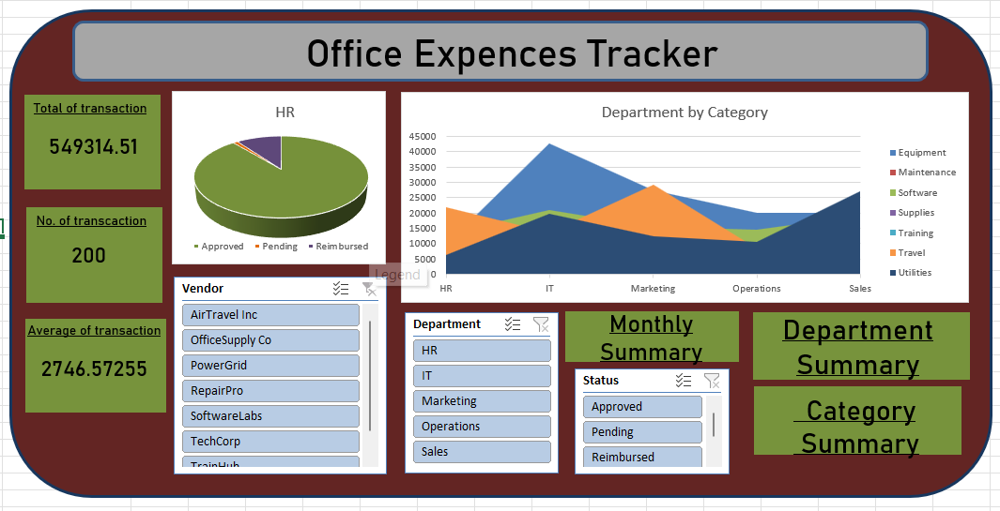

# Office Expense Tracker Dashboard 📊💼

## 📌 Project Overview

The **Office Expense Tracker Dashboard** is a data analysis and visualization project designed to monitor, analyze, and control organizational expenses effectively. Built using **Microsoft Excel**, this dashboard provides clear insights into spending patterns, category-wise expenses, and monthly trends to support better financial decision-making.

This project is suitable for **small to medium-sized businesses**, **finance teams**, and **individuals** who want a simple yet powerful expense tracking solution.

---

## 🎯 Objectives

* Track office expenses in a structured format
* Analyze expenses by **category**, **department**, and **date**
* Identify high-cost areas and cost-saving opportunities
* Provide a summarized and visual representation of expenses

---

## 🗂️ Dataset Description

The dataset is maintained in Excel and typically includes the following columns:

* **Date** – Expense transaction date
* **Expense Category** – Rent, Utilities, Travel, Stationery, Salary, etc.
* **Department** – HR, IT, Finance, Operations, etc.
* **Expense Description** – Brief details of the expense
* **Payment Mode** – Cash, Card, Bank Transfer, UPI
* **Amount** – Expense amount

---

## 📊 Dashboard Features

* **Total Expenses Overview** – Quick snapshot of overall spending
* **Category-wise Expense Breakdown** – Identifies major cost contributors
* **Department-wise Analysis** – Helps monitor departmental budgets
* **Monthly Expense Trend** – Tracks spending over time
* **Interactive Filters/Slicers** – Filter by date, category, or department

---

## 🛠️ Tools & Techniques Used

* **Microsoft Excel**

  * Pivot Tables
  * Pivot Charts
  * Slicers
  * Excel Formulas (SUM, IF, VLOOKUP/XLOOKUP)
  * Data Cleaning & Formatting

---

## 📈 Key Insights

* Identifies months with unusually high expenses
* Highlights departments with maximum spending
* Helps compare planned vs actual expenses
* Improves financial transparency and control

---

## 👥 Who Can Use This Dashboard?

* Office Administrators
* Finance & Accounts Teams
* Business Owners
* Students & Freshers (for portfolio projects)

---

## 🚀 How to Use

1. Open the Excel file (`Office_Expense_Tracker.xlsx`)
2. Update or add new expense records in the data sheet
3. Refresh Pivot Tables (Right-click → Refresh)
4. Use slicers to explore insights dynamically

---

## 📌 Future Enhancements

* Budget vs Actual comparison
* Automated expense entry using forms
* Power BI version of the dashboard
* Year-over-Year expense comparison

---

## 🖼️ Dashboard Screenshot

Below is a snapshot of the **Office Expense Tracker Dashboard** created in Excel:

---

## 🏷️ Keywords

`Excel Dashboard` `Office Expense Tracker` `Financial Analysis` `Expense Management` `Data Analysis Project`

---

## 📄 License

This project is for **learning and portfolio purposes**. Feel free to customize and enhance it.

---
